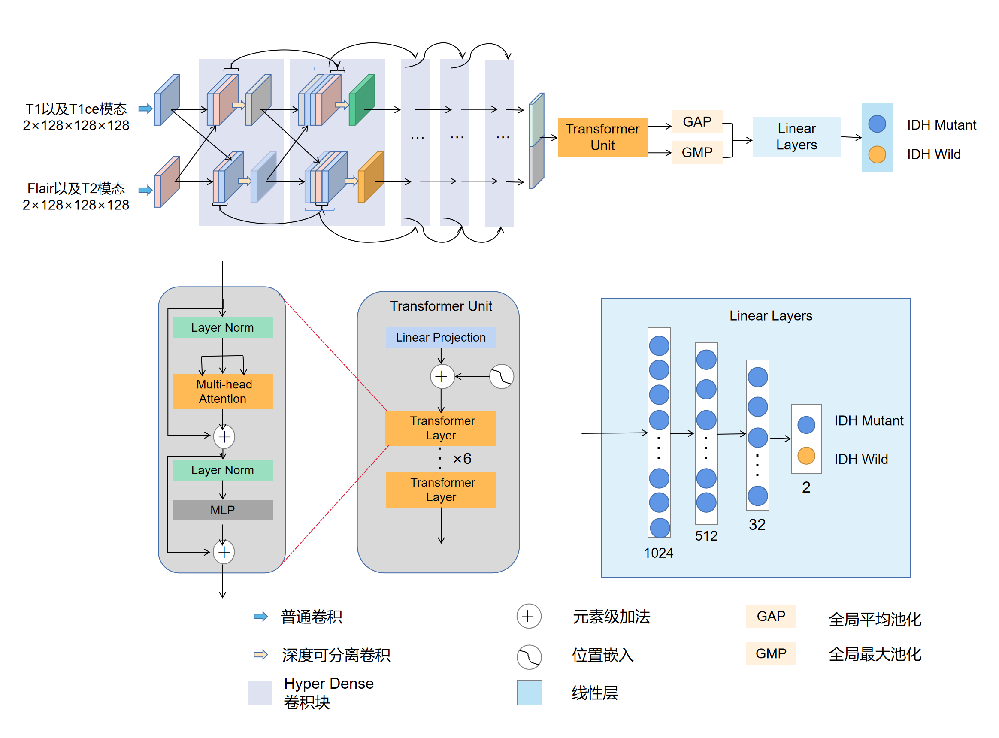
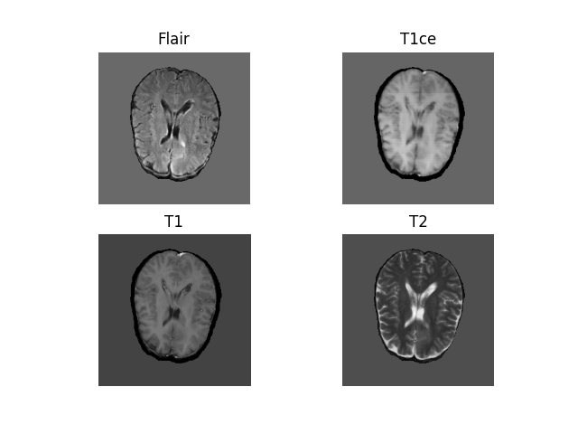
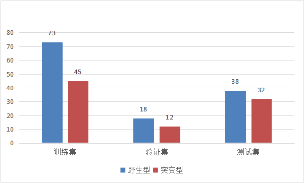

## 说明
**本项目仅供学习使用。** 
本项目在多模态MRI图像融合方式和模型架构上作出了一定的改进，所解决的问题为脑胶质瘤IDH基因分型。
## 模型架构

&emsp;&emsp;HDT-Net前面一部分网络结构为Hyper Dense结构，该结构的目的是在特征级别对多模态MRI图像进行融合。Hyper Dense结构被分为两路，这两路的拓扑结构是一致的。每个Hyper Dense块的卷积都是深度可分离卷积，这样做的目的是为了加深网络深度，同时减少参数量，对多模态特征做更好地融合。后面的部分是由六层Transformer层组合得到的Transformer Unit，用来对上下两路的特征信息作进一步融合，更好地捕获全局信息。 
&emsp;&emsp;将T1和T1ce模态图片连接成为一个新维度，再经过一个普通卷积作特征提取，最后作为输入进入到上面一路网络中去；同样地，我们将T2和Flair模态图片连接在一起，再经过相同操作进入到下面一路网络中去。之所以这样分类，是因为T1和T1ce模态图片适合分割不发生瘤周水肿的肿瘤；而T2和Flair适合分割有瘤周水肿的肿瘤。这说明，T1和T1ce模态图片能够提供的相近的信息，T2和Flair模态也是如此。所以，我们通过Hyper Dense结构将两类图片信息进行交互融合，以达到更好地提取图片信息的效果。 
&emsp;&emsp;在经过Transformer单元之后，由于我们的输出比较大，如果再使用线性层的话，参数量和计算量都比较大。所以我们将Transformer的输出形状重新变为五维向量，再经过池化操作进行下采样。这样既能增强模型的泛化性能，又能够减少模型的参数量和计算量。这里，我们同时使用三维全局平均池化和最大池化。因为全局平均池化能够得到图片的整体特征，而最大池化能够保留图片的纹理信息和突出的特征信息。所以我们同时使用两个池化方法以尽量保留图片信息。
## 数据集
&emsp;&emsp;本项目所研究的神经胶质瘤患者的多模态MRI图像来源于多模态脑肿瘤分割（BraTS2021）比赛。BraTS2021的部分数据属于癌症成像档案（TCIA），基因组信息由癌症基因组图谱（TCGA）提供。本研究使用的数据为含有IDH突变状态的流体衰减反转恢复成像（FLAIR）、t1加权成像（T1）、t1加权对比增强成像（T1ce）和t2加权成像（T2）图片。下图为相关模态的信息。

 
&emsp;&emsp;最终的数据集包括148名BraTS2021训练数据集中含IDH突变状态的受试者作为训练和验证数据，BraTS2021验证数据集中70名含IDH突变状态的受试者作为测试数据。下图详细说明了本研究所用数据信息。

## 实验结果

